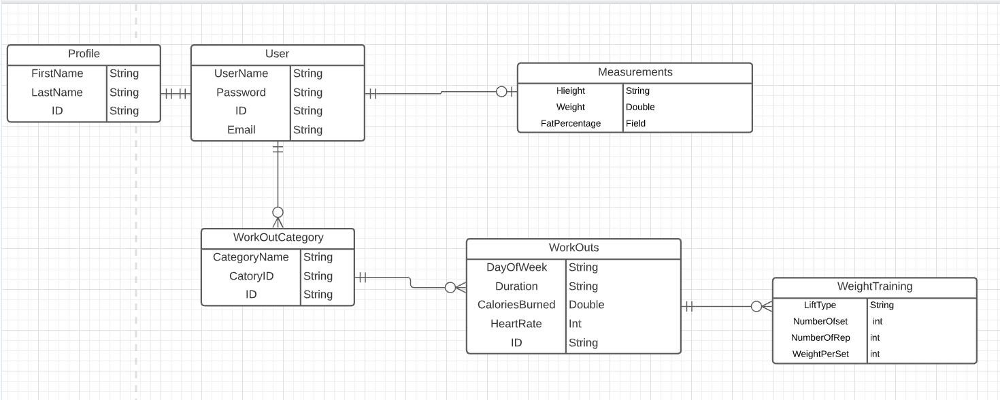
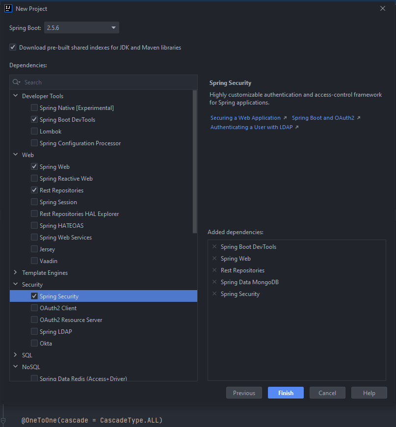
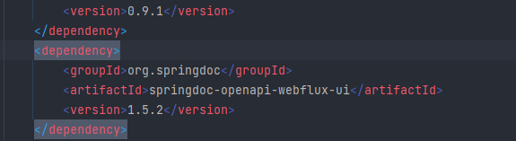
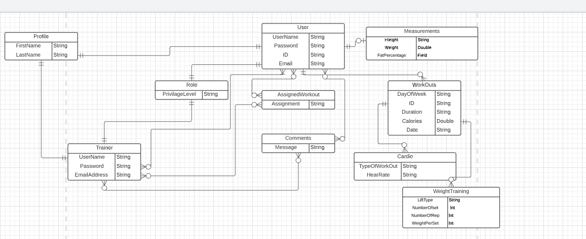
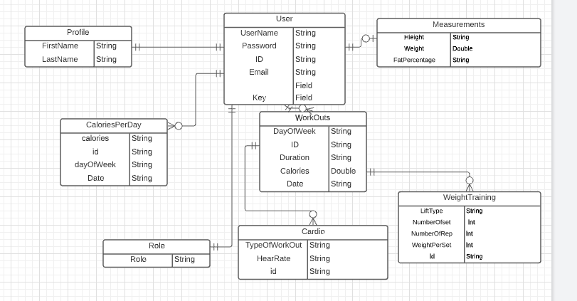
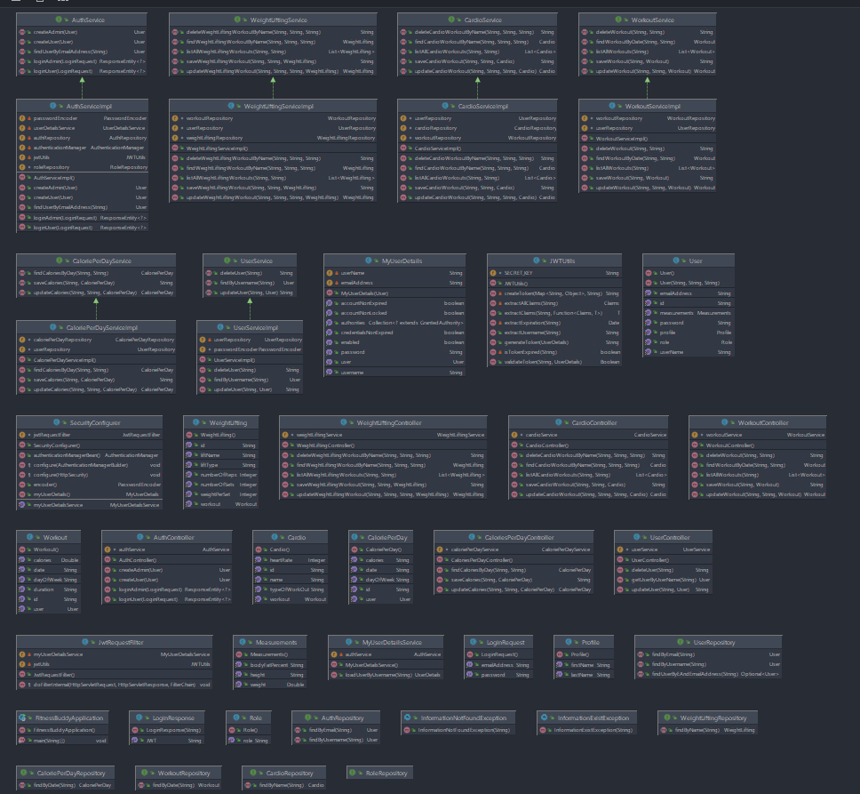
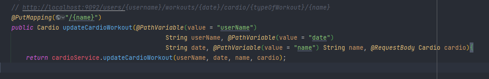
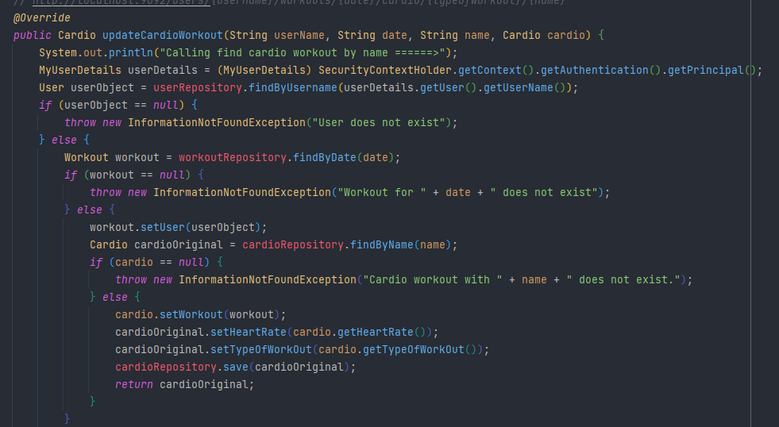

# Summary of Project:

We are designing a fitness app that will keep track of different user workouts. User will be able to create a profile
and keep track of different workouts completed such as cardio, cycling, weightlifting etc by day. The user will also be able to keep
track of workouts and workout measurements such as hear rate, calories burned and length of workout. Additionally,
weightlifting workouts will include additional measurements such as reps, sets completed and amount of weight lifted.

# User Stories

* As a user I want to be able to register for the app. (B)
* As a user I want to be able to enter my measurements (weight, height, body fat %) (B)
* As a user I want to be able to edit my workout details. (B)
* As a user I want to be able to delete a workout. (B)
* As a user I want to be able to have different types of workout options. (B)
* As a user I want to be able to complete multiple workouts. (B)
* As a user I want to be able to have a summary of my workout details. (B)
* As a user I want to be able to keep track of my consumed calories. (S)
* As a trainer I want to be able to assign workouts to other users. (S)
* I want to be able to have different types of profiles for the app. (G)
* As a user I want to be able to create a diet plan. (G)
* As a user I want to be able to have workouts assigned to me by a trainer. (G)
* As a user I want to be able to keep track of weight loss. (G)
* As a user I want to be able to link my account with other fitness apps. (P)

# Original ERD

# Dependencies Added

# Spring Doc Dependency
* this allows for the size annotation, which is supposed to restrict the size of the input received. However, we were never able to get this to work. 

# Goal ERD

# Final ERDs

 # Day 1 (Theory)
1. Brainstorming ideas
2. Creating initial ERD Diagram
3. Writing User Stories
4. Get approval
5. Create user 
6. Create profile
7. add security dependencies

# Day 2
1. Build out basic model
2. Build out basic controller
3. Create CRUD functionality
4. Test each function

# Day 3
1. Continue to build out models and controllers
2. Test everything!
3. Start on silver objectives
4. Add trainer profile

# Day 4
1. Test again
2. Create different profile types (G)
3. Add workout plans (S)
4. Total calories consumed (G)
5. Create diet plans (G)
6. Running total of weight loss (G)
7. Test, test, test!

# Day 5
1. Code cleanup
2. Readme Cleanup
3. Code annotation

#END Points
| http:// Method| Endpoint| Description| Public/Private
|--|--|--|--|
||**Users**
| POST|http://localhost:9092/auth/users/register | register user | Public
| POST|http://localhost:9092/auth/users/login | login user | Public
| GET | http://localhost:9092/users/{username} | Get by username | Private
|PUT|http://localhost:9092/users/{username}|update user | Private
|DELETE | http://localhost:9092/users/{username} | delete user | Private
||**Admin**
|POST | http://localhost:9092/auth/admin/register | register admin | Public
|POST | http://localhost:9092/auth/admin/login | login admin | Public
||**Workout Category**
|POST | http://localhost:9092/users/{username}/workouts|Save/Create Workout | Private
|GET | http://localhost:9092/users/{username}/workouts/{date}|Find workout by date | Private
|PUT | http://localhost:9092/users/{username}/workouts/{date}|Update Workout | Private
|DELETE | http://localhost:9092/users/{username}/workouts/{date}|Delete Workout | Private
|GET |http://localhost:9092/users/{username}/workouts|List all workouts | Private
||**Cardio Category**
|POST |http://localhost:9092/users/{username}/workouts/{date}/cardio|Save/Create Cardio W/O | Private
|GET |http://localhost:9092/users/{username}/workouts/{date}/cardio|Find cardio W/O by date | Private
|GET | http://localhost:9092/users/{username}/workouts/{date}/cardio/{typeOfWorkout}/{name} |get workout by name | Private
|PUT |http://localhost:9092/users/{username}/workouts/{date}/cardio/{typeOfWorkout}/{name}|Update cardio W/O | Private
|DELETE |http://localhost:9092/users/{username}/workouts/{date}/cardio/{typeOfWorkout/{name}|Delete cardio W/O | Private
| | **Weightlifting Category**
| POST | http://localhost:9092/users/{username}/workouts/{date}/weightlifting | Save/Create WL W/O | Private
| GET | http://localhost:9092/users/{username}/workouts/{date}/weightlifting | Find all WL W/O by date | Private
|GET | http://localhost:9092/users/{username}/workouts/{dweightlifting/{typeOfWorkout}/{name} |get workout by name | Private
| PUT | http://localhost:9092/users/{username}/workouts/{date}/weightlifting/{typeOfWorkout}/{name} | Update WL W/O | Private
| DELETE | http://localhost:9092/users/{username}/workouts/{date}/weightlifting/{typeOfWorkout}/{name} | Delete WL W/O | Private

# Day 1
We started by brainstorming different ideas. We went everywhere from fraud detection, a podcast app and then to an API for a gym website.  We finally landed with the fitness app. We started by creating our initial ERD and writing our user stories. We had a pretty good idea of what we wanted to accomplish. Unfortunately, our eyes were bigger than our stomach. More on that later. We presented our plan for the app and got approval and got right to work. We created then implemented the dev-properties and added the necessary security packages at the end of day 1.

# (Saturday)
We wanted to be able to set parameters for the username and password. The spring doc dependency was added to the pom file. We were having issues with user login with MongoDB. MongoDB was not showing any of the accounts that we were storing in the database. However, something was being stored as it was not allowing for duplicates. Mongo DB stopped working for Paul altogether and he had to re-install.

# Day 2
We were having lots of issues with the security and JWT filter. We had used the code mostly the same way we had in previous projects but for some reason it wasn’t working the same here. After some searching and some help from Suresh, we discovered that we needed to add to the security configuration file a line that made it work:
"http.addFilterBefore(jwtRequestFilter, UsernamePasswordAuthenticationFilter.class);" to security configuration configure and remove "&& SecurityContextHolder.getContext().getAuthentication() == null" from JWT request filer doFilterInternal, in order for JWT token to work.

This took the bulk of our day, and we didn’t get much of what we wanted to be accomplished. We were able to refactor the user controller and added to our exception classes. We also were able to create the user class and were able to get it working. Day 2 left us feeling extremely deflated and we weren’t very enthusiastic about our progress so far. This all changed on day 3.

# Day 3
We got ALOT accomplished on day 3.
1. Added delete user method
2. Tested delete user method
3. Added measurement controller, service and model
4. refactored code and updated user register and user update to allow for measurements
5. Added workouts collection
6. Added workouts classes
7. Added save workout method
8. Tested save workout method
9. Created list workout method
10. Tested list workout method
11. update to update workout

The user update was fairly difficult. It took quite a bit of refactoring and thinking to make it work the way that we needed. The good news was that once this was done, we were able to breeze through many of the rest of methods easily.

# Day 4
Day four was much of the same. We were able to get through many of our methods with relative ease.
We tested and updated the delete workout method and ensured it was functional. We created the cardio classes and interfaces and were able to get the saveCardio created, working and tested. Full CRUD was operational for this class. Weightlifting was practically a mirror image of cardio so again we were able to breeze through the majority of this.

# Day 5
We had one more method that we wanted to try and implement. We wanted to be able to assign different user roles. We started working through the different ways this could have been accomplished short of having to refactor all of our code. We attempted to refactor the security packages to make it work but were realizing that there simply was not enough time. We did however create a separate role and login for a trainer but were unable to have them successfully login. We did create a calorie count as part of are silver goals, as we did want to full accomplish at least one of these. We finished the day with code cleanup, code annotation and clean up of our README. 

# Challenges Faced:
1. Security methods changes. 
2. MongoDB was not showing any of the account we were storing to the database, however, something was being stored as it was not allowing duplicates.
3. MongoDB stopped working for Paul all together, had to uninstall. 
4. Issues with logging in, needed to add "http.addFilterBefore(jwtRequestFilter, UsernamePasswordAuthenticationFilter.class);" to security configuration configure and remove "&& SecurityContextHolder.getContext().getAuthentication() == null" from JWT request filer doFilterInternal, in order for JWT token to work.
5. We ran in to many issues with trying to get our update user class working. We had hoped to have finished our full CRUD
   operations before Day 2 was over.
6. never got @size and @Notblank to work. 

# Future Plans:
1. To allow for trainers profiles to be created
2. Trainers would have additional functionality such as assigning workouts providing feedback
3. Connecting to Google API

# What Would We Do Differently?
1. start by building roles in to the system from day one. 
2. Try and plan out the implication of the overall goal structure from the start instead on trying to go back and change things.
# What Are We Most Proud Of?
1. managing to get a working application after all the setbacks of the first couple of days and the lesson we learned along the way that allowed us to be able to understand NoSQL better. 

# Method We are Most Proud Of?
* Are updating cardio, method was the first method at this layer of DRef were we need to associate the record with both the user, and the workout. We had spent the second day of the project just trying to get our update user to function properly. This was many steps past this as we had to understand each path variable we would need and what would need to be checked for error each step along the path.

# What Did We Learn?
1. how to implement NoSQL compared to SQL. 
2. Need to plan ahead better for the entire scope of what the final gaol is. 
3. Dont use capital letters in your models for name, it won't work. 
4. don't try and add a new document and features in an hour. it will drive you insane. 

## Technologies Leveraged :

|     Tech. Name     |            Utilization in Project            |
| ------------------ | -------------------------------------------- |
| Bcrypt             | Hashing function stores passwords in DB.     |
| Java 17            | Code language.                               |
| JWT                | JSON signed with HS256 algorithm.            |
| Maven              | Java dependency management.                  |
| MongoDB            | NoSQL DATBase Database.                      |
| Spring Boot        | API framework.                               |
| Spring Security    | Framework providing JWT authentication.      |

